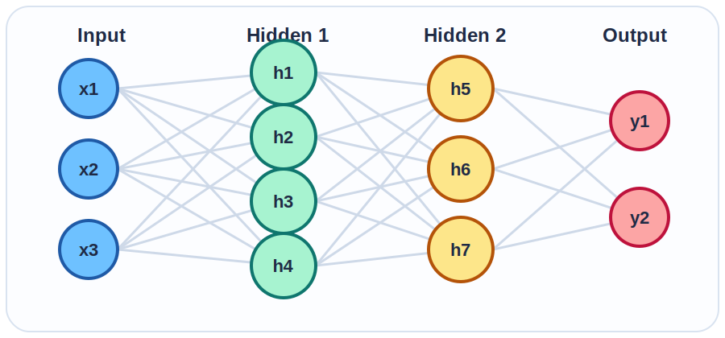
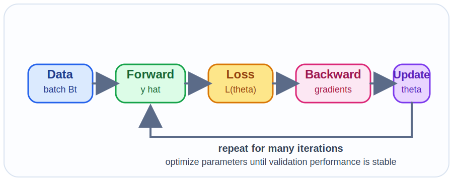

# 神经网络基础

Neural Network（神经网络）可以看成一个参数化函数. 

输入数据 $x$，输出预测结果 $\hat y$，中间通过多层线性变换和非线性激活逐步提取特征。

$$
f_\theta(x)
= W^{(L)} h^{(L-1)} + b^{(L)},
\qquad
h^{(\ell)} = \phi\left(W^{(\ell)} h^{(\ell-1)} + b^{(\ell)}\right)
$$

- 参数 $\theta$ 包含所有层的权重 $W$ 和偏置 $b$
- 激活函数 $\phi$ 让模型能够表达非线性关系
- 多层全连接结构通常称为 Multi-Layer Perceptron（多层感知机，MLP）
- 训练目标是让 $f_\theta(x)$ 尽可能接近真实标签 $y$

  

---

# 训练数据

监督学习里，我们通常从一个数据集出发：

$$
\mathcal D = \{(x_i, y_i)\}_{i=1}^{N}
$$

其中：

- $x_i$ 是第 $i$ 个样本的输入特征
- $y_i$ 是第 $i$ 个样本的监督信号或标签
- $N$ 是训练样本总数

  

    
表格数据

    
$x_i \in \mathbb R^d$

    
例如年龄、收入、点击率等数值特征。

  

  

    
图像数据

    
$$ x_i \in \mathbb R^{H \times W \times C} $$

    
例如像素矩阵、通道信息。

  

  

    
文本数据

    
$x_i = (t_1, \dots, t_T)$

    
先经过 Tokenization（分词）再映射成向量。

  

--- 

Mini-batch（小批量）训练时，常把样本堆叠成矩阵：

$$
X \in \mathbb R^{B \times d},
\qquad
Y \in \mathbb R^{B \times k}
$$

其中 $B$ 是 batch size（批大小），$d$ 是输入维度，$k$ 是输出维度。

实践中还会把数据分成 training set（训练集）、validation set（验证集）和 test set（测试集），分别用于拟合参数、调超参数和评估泛化能力。

<!-- 
| 类型 | 数学表示 | 例子 |
| --- | --- | --- |
| 表格数据 | $x_i \in \mathbb R^d$ | 例如年龄、收入、点击率等数值特征。 |
| 图像数据 | $x_i \in \mathbb R^{H \times W \times C}$ | 例如像素矩阵、通道信息。 |
| 文本数据 | $x_i = (t_1, \dots, t_T)$ | 先经过 Tokenization（分词）再映射成向量。 | 

Mini-batch（小批量）训练时，常把样本堆叠成矩阵：

$$
X \in \mathbb R^{B \times d},
\qquad
Y \in \mathbb R^{B \times k}
$$

其中 $B$ 是 batch size（批大小），$d$ 是输入维度，$k$ 是输出维度。

实践中还会把数据分成 training set（训练集）、validation set（验证集）和 test set（测试集），分别用于拟合参数、调超参数和评估泛化能力。 -->

---

# 从单个神经元到前向传播

单个神经元先做一次线性变换，再通过激活函数：

$$
z = w^\top x + b,
\qquad
a = \phi(z)
$$

## 常见激活函数

- Rectified Linear Unit（线性整流函数，ReLU）
- sigmoid（S 形函数）
- tanh（双曲正切函数）

## 作用

- 把输入特征映射到新的表示空间
- 让多层网络能够拟合复杂决策边界
- 避免整个网络退化成单纯的线性模型

## 批量前向传播

$$
H^{(1)} = \phi(XW^{(1)} + b^{(1)})
$$

$$
H^{(2)} = \phi(H^{(1)}W^{(2)} + b^{(2)})
$$

$$
\hat Y = H^{(2)}W^{(3)} + b^{(3)}
$$

前向传播（forward pass）的本质是：把原始输入一步步变成更适合当前任务的特征表示，最后输出预测值。

---

# 学什么：损失函数与经验风险最小化

训练神经网络，本质上是在最小化经验风险：

$$
\min_{\theta}\ \mathcal L(\theta)
= \frac{1}{N} \sum_{i=1}^{N} \ell\left(f_\theta(x_i), y_i\right) + \lambda \Omega(\theta)
$$

其中：

- $\ell(\hat y, y)$ 衡量预测与真实标签的差异
- $\Omega(\theta)$ 是正则项，例如 $\lVert \theta \rVert_2^2$
- $\lambda$ 控制拟合误差和模型复杂度之间的权衡

  

    
回归任务

    
常用 Mean Squared Error（均方误差，MSE）

$$
\ell_{\text{MSE}}(\hat y, y) = \frac{1}{2}\lVert \hat y - y \rVert_2^2
$$

  

  

    
分类任务

    
常用 Cross-Entropy（交叉熵）

$$
\ell_{\text{CE}}(\hat y, y) = - \sum_{c=1}^{C} y_c \log \hat y_c
$$

  

---

# 怎么求梯度：Back propagation（反向传播）

反向传播利用 Chain Rule（链式法则），把损失对输出的误差逐层传回每一层参数。

对第 $\ell$ 层，记：

$$
z^{(\ell)} = W^{(\ell)} h^{(\ell-1)} + b^{(\ell)},
\qquad
h^{(\ell)} = \phi\left(z^{(\ell)}\right)
$$

则隐藏层误差可以递推为：

$$
\delta^{(\ell)}
= \left(W^{(\ell+1)}\right)^\top \delta^{(\ell+1)}
\odot \phi'\left(z^{(\ell)}\right)
$$

相应地，梯度可以写成：

$$
\frac{\partial \mathcal L}{\partial W^{(\ell)}}
= \delta^{(\ell)} \left(h^{(\ell-1)}\right)^\top
$$

$$
\frac{\partial \mathcal L}{\partial b^{(\ell)}}
= \delta^{(\ell)}
$$

直觉上，反向传播回答的是一个核心问题：当前预测错了多少，以及每一层参数分别对这个错误“负责”多少。

---

# 怎么更新参数：Gradient Descent（梯度下降）

拿到梯度以后，就可以更新参数：

$$
\theta_{t+1} = \theta_t - \eta \nabla_\theta \mathcal L(\theta_t)
$$

其中 $\eta$ 是 learning rate（学习率）。

## 常见优化方法

- Batch Gradient Descent（批量梯度下降）：每次用全部样本算梯度
- Stochastic Gradient Descent（随机梯度下降，SGD）：每次用单个样本
- Mini-batch SGD（小批量随机梯度下降）：每次用一小批样本，实践中最常用
- Adam（自适应矩估计）：结合一阶矩和二阶矩的自适应优化器

$$
m_t = \beta_1 m_{t-1} + (1-\beta_1) g_t
$$

$$
v_t = \beta_2 v_{t-1} + (1-\beta_2) g_t^2
$$

$$
\theta_{t+1}
= \theta_t - \eta \frac{\hat m_t}{\sqrt{\hat v_t} + \epsilon}
$$

  

- 一个完整训练循环通常按 `采样 batch -> 前向传播 -> 计算 loss -> 反向传播 -> 更新参数` 反复进行
- 常见超参数包括 epoch（轮数）、batch size 和 learning rate

---

# 从神经网络到 Transformer

Transformer 并没有跳出神经网络的范式，它仍然遵循同一套训练逻辑：

1. 定义输入和输出
2. 设计可微分的网络结构
3. 写出损失函数
4. 用反向传播计算梯度
5. 用 SGD 或 Adam 更新参数

区别主要不在“是否是神经网络”，而在于结构本身：
MLP 使用全连接层，CNN 使用卷积层，RNN 使用递归结构，而 Transformer 使用 self-attention（自注意力）机制。

  

    
MLP

    
全连接层擅长处理固定长度特征。

  

  

    
CNN

    
卷积结构擅长提取局部空间模式。

  

  

    
RNN

    
递归结构适合顺序建模，但长依赖较难。

  

  

    
Transformer

    
self-attention 更擅长捕捉长程依赖。

  

动态演示：
 
<a href="https://playground.tensorflow.org" target="_blank">TensorFlow Playground</a>
 
可以直观看到隐藏层、激活函数和学习率如何影响分类边界。

